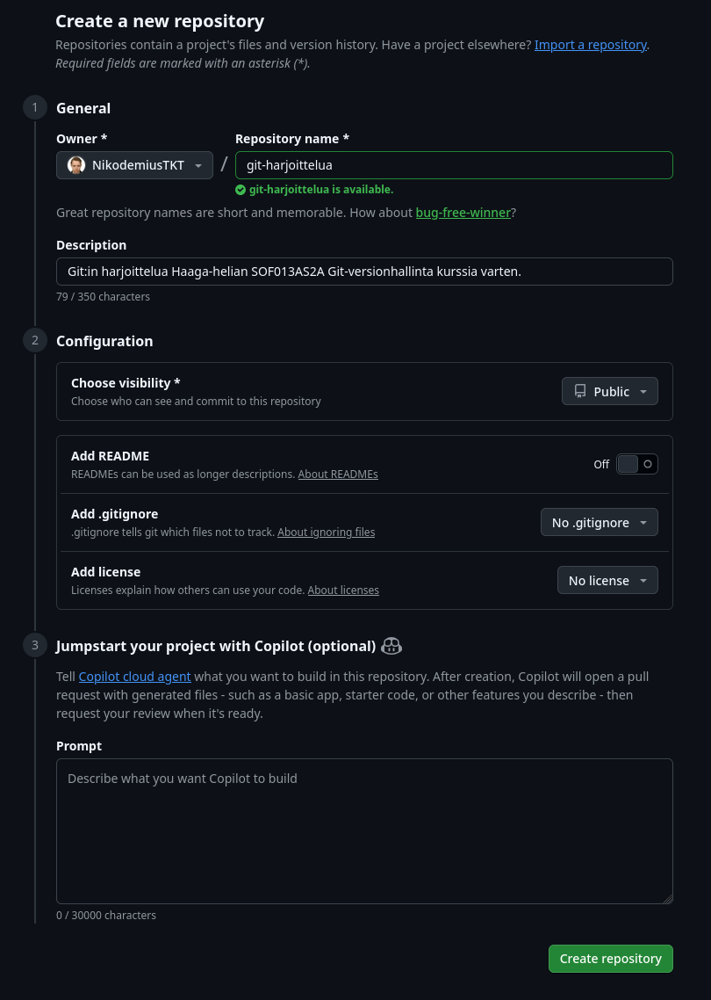
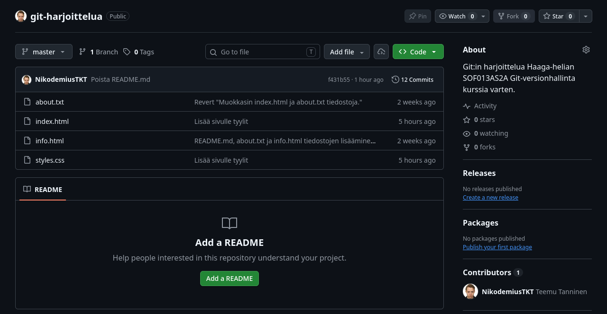
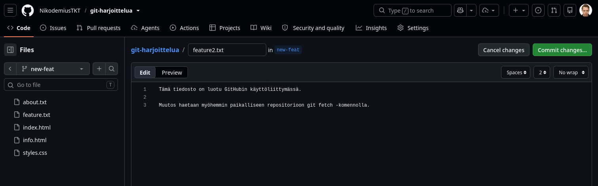
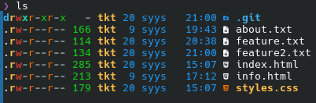
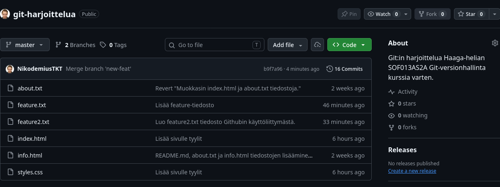

# Harjoitus 5 – GitHub ja etärepositorio

## 1. Tyhjän repositorion luominen GitHubiin

Loin GitHubiin uuden tyhjän repositorion.



---

## 2. Etärepositorion määrittäminen

Määritin GitHub-repositorion paikallisen repositorion etärepositorioksi nimellä `origin`.

### Komento

```bash
git remote add origin https://github.com/NikodemiusTKT/git-harjoittelua.git
```

### Tarkistin etärepositorion asetukset

```bash
git remote -v
```

Tuloste:

```
origin	https://github.com/NikodemiusTKT/git-harjoittelua.git (fetch)
origin	https://github.com/NikodemiusTKT/git-harjoittelua.git (push)

```

---

## 3. `master`-haaran vieminen GitHubiin

Puskin paikallisen `master`-haaran GitHubiin.

### Komento


```bash
git push -u origin master
```

### Mitä GitHub-repositoriosivulla nyt näkyy?

Github repositorysivulla näkyy kaikki paikallisesta hakemistosta haetut tiedostot.



---

### Mitä haaroja GitHubissa näkyy?

Githubissa näkyy vain yksi `master` haara.

---

### Mitä haaroja paikallisessa repositoriossa näkyy?

```bash
git branch
```

Tuloste:

```text
* master
  tyylit

```

Paikallisessa repositoriossa näkyy kaksi haaraa `master` ja `tyylit`.

---

## 4. `new-feat`-ominaisuushaaran luominen

Loin paikalliseen repositorioon ominaisuushaaran nimeltä `new-feat` ja siirryin siihen.

### Komennot

```bash
git switch -c new-feat
```

### Uuden tiedoston luominen

Tiedoston nimi:

```text
feature.txt
```

Sisältö:

```text
Tämä tiedosto on luotu paikallisesti new-feat-haaraan.

Harjoittelen tässä Gitin etärepositorion käyttöä.
```

### Talletin muutoksen

```bash
git add feature.txt
git commit -m "Lisätty feature-tiedosto"
```

---

## 5. `new-feat`-haaran vieminen etärepositorioon

Tarkistin paikalliset haarat:

```bash
git branch
```

Tuloste:

```text
  master
* new-feat
  tyylit

```

### Vein `new-feat`-haaran GitHubiin

```bash
git push -u origin new-feat 
```

### Tarkistin GitHubin käyttöliittymästä

**Havainto:**

Github:ssa on nyt kaksi haaraa `master` ja `new-feat`, joista `new-feat` haaraan kuuluu uusi lisätty tiedosto `feature.txt`.


---

## 6. Tiedoston luominen GitHubin käyttöliittymässä

Loin GitHubin käyttöliittymässä `new-feat`-haaraan uuden tiedoston.



---

## 7. Etärepositorion muutosten hakeminen `fetch`-komennolla

### Tarkistin ensin repositorion tilanteen

```bash
git status
```

Tuloste:

```text
On branch new-feat
Your branch is up to date with 'origin/new-feat'.

nothing to commit, working tree clean

```
`git status` komennon mukaan paikallisesti ei ole siis tapahtunut mitään muutoksia.

### Hain etärepositorion muutokset

```bash
git fetch
```

### Tarkistin tilanteen uudelleen

```bash id="m2x8q6"
git status
```

Tuloste:

```text id="c7r4n1"
On branch new-feat
Your branch is behind 'origin/new-feat' by 1 commit, and can be fast-forwarded.
  (use "git pull" to update your local branch)

nothing to commit, working tree clean

```

### Mitä muuttui?

Paikallinen haara on yhden tallennuksen jäljessä etärepositorion `origin/new-feat` haaraa ja muutokset on mahdollista yhdistää samaan haaraan suoraan pikakelauksella (fast-forward).

---

## 8. Etärepositorion haaraan siirtyminen

Katsoin `fetch`-komennolla haettuja muutoksia vaihtamalla `origin/new-feat`-haaraan.

### Komento

```bash
git switch origin/new-feat
```

### Havainto

Github verkkosivulla tekemäni muutokset mukaan lukien lisätty `feature2.txt` tiedosto näkyy nyt myös paikallisessa työhakemistossani.



---

## 9. Etärepositorion muutosten yhdistäminen paikalliseen haaraan

Palasin paikalliseen `new-feat`-haaraan.

### Komento

```bash
git switch new-feat
```

Yhdistin `origin/new-feat`-haaran muutokset paikalliseen `new-feat`-haaraan.

### Komento

```bash
git merge --no-ff origin/new-feat
```

### Tarkistin repositorion tilanteen

```bash id="p3q8c5"
git status
```

### Mitä `git status` näyttää?

```text
On branch new-feat
Your branch is ahead of 'origin/new-feat' by 1 commit.
  (use "git push" to publish your local commits)

nothing to commit, working tree clean

```

Paikallinen `new-feat` haarani on nyt yhden talletuksen edellä `origin/new-feat` etähaaraani. Minun on siis puskettava paikalliset muutokset etärepositorioon, jotta ne olisivat synkronisoitu keskenään.

---

## 10. `new-feat`-haaran yhdistäminen `master`-haaraan

Vaihdoin `master`-haaraan:

```bash
git switch master
```

Yhdistin `new-feat`-haaran `master`-haaraan:

```bash
git merge --no-ff new-feat
```

### Vein muutokset etärepositorioon

```bash
git push -u origin master
```

### Tarkistin lopputuloksen GitHubin käyttöliittymästä

**Havainto:**

Molemmat paikallisesti lisäämäni `feature.txt` ja Github-käyttöliittymässä lisäämäni `feature2.txt` tiedostot näkyvät nyt myös etäreposition `master` haarassa.



---

## 11. Tunnisteen lisääminen

Lisäsin viimeisimpään talletukseen tunnisteen:

```bash
git tag harjoitus5
```


### Tarkistin lopullisen historian

```bash
git log --oneline --decorate --graph --all
```

**Tuloste:**

```bash
*   b9f7a96 (HEAD -> master, tag: harjoitus5, origin/master, origin/HEAD) Merge branch 'new-feat'
|\  
| *   fd400d2 (new-feat) Merge remote-tracking branch 'origin/new-feat' into new-feat
| |\  
| | * c9de7f8 (origin/new-feat) Luo feature2.txt tiedosto Githubin käyttöliittymästä.
| |/  
| * e6869eb Lisää feature-tiedosto
|/  
* f431b55 Poista README.md
*   e973da0 (tag: harjoitus4) Yhdistä 'tyylit' haara 'Master' haaraan.
|\  
| * abe0742 (tyylit) Lisää sivulle tyylit
|/  
* 0f0d212 Lisää HTML-sivun perusrakenne
* 8ca16dc (tag: harjoitus3) Revert "Muokkasin index.html ja about.txt tiedostoja."
* face3ab Muokkasin index.html ja about.txt tiedostoja. Lisäsin uusi1.txt ja uusi2.txt tiedostot.
* d2dc0a6 (tag: harjoitus2) README.md, about.txt ja info.html tiedostojen lisääminen versionhallintaan
* 1a1bc87 text.txt tiedoston poistaminen
* f3d1afb hello.html tiedoston muuttaminen index.html tiedostoksi
* b426870 hello.html-tiedoston muuttaminen html-muotoon
* 1c2779e hello.html-tiedoston luominen
* 468dd4e text.txt tiedoston luominen ja tallettaminen

```

---

# Yhteenveto

## Harjoituksessa käytetyt Git-komennot

```bash id="z5n8c2"
git remote
git remote -v
git push
git branch
git switch
git fetch
git merge
git status
git log
git tag
```

